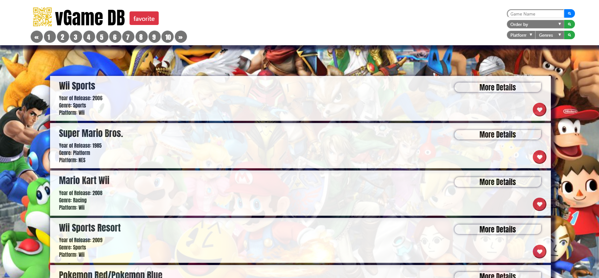
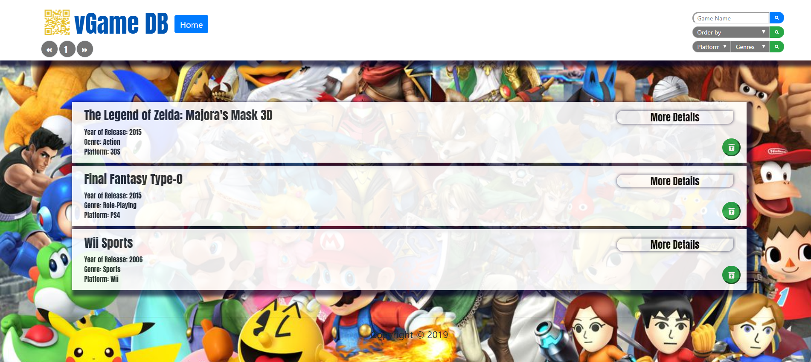
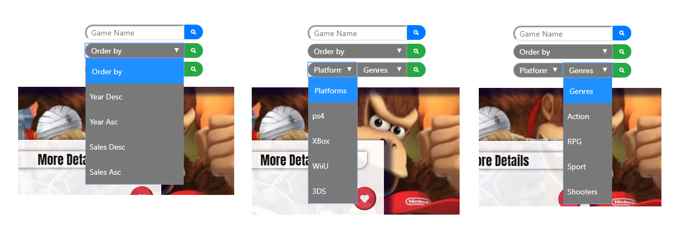
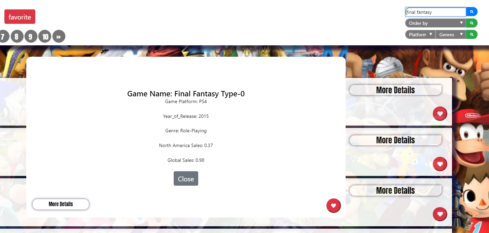
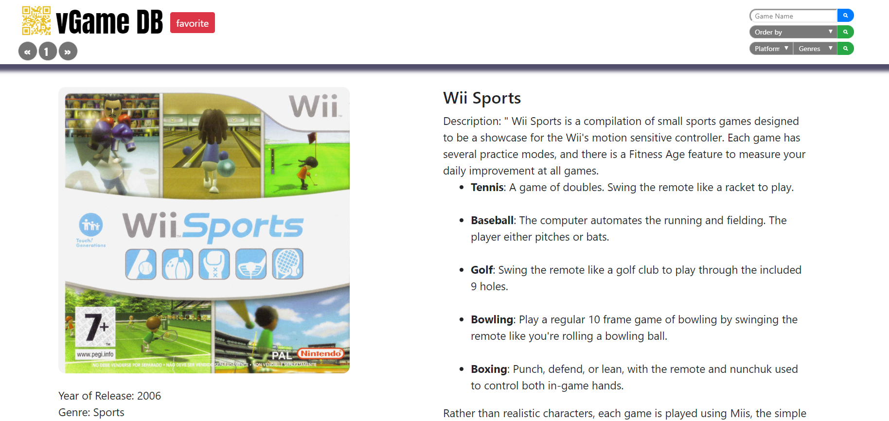
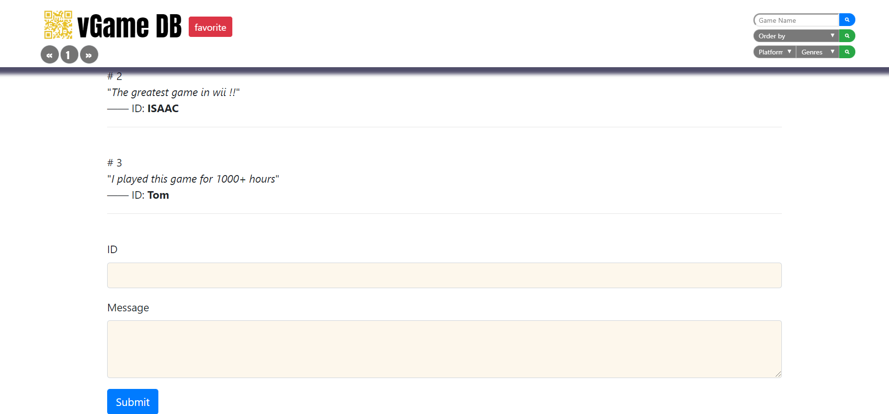

# 👾 VGAMEDB

An app saved more than 16,000 video games information since 1984 in database. 
-	Users can search every game’s Year of Release, Genre, Platform, Global Sales, Game Description.
-	API load games Cover Image and show the images when available.
-	VGAMEDB support to checking games by sorting and ordering.
-	Users can also save their favorites games and leave comments.

#### 👾 Home page & Saved page

#### 👾 Sort/Order & Search

#### 👾 API image, description  &  Comments

#### 👾 Technologies
- [x] MySql
- [x] Sequelize ORM
- [x] Node Express
- [x] handlebars
- [x] Google Books API
- [x] JavaScript
- [x] CSS/Bootstrap
- [x] API

#### 👾 Author
* [Isaac Wu](https://github.com/squall2046)
* [App demo](https://vgamedb.herokuapp.com/)

## Copyright
Isaac Wu © 2019 All Rights Reserved
